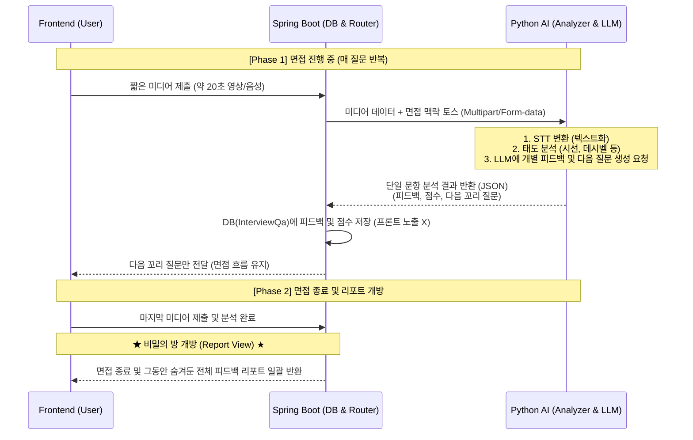

# 🤖 Spring Boot & Python AI 보조 서버 연동 아키텍처 (MSA)

본 문서는 실감 나는 AI 면접 시뮬레이션을 구현하기 위해, 자바(Spring Boot) 백엔드와 파이썬(Python) AI 보조 서버가 어떻게 협력하고 데이터를 주고받는지 전체적인 흐름과 각 서버의 개발 역할을 정의합니다.

---

## 1. 아키텍처 개요 (Architecture Overview)

영상(자세, 시선) 및 오디오(음성 크기, 빠르기) 데이터 분석과 같은 고연산 미디어 처리 작업은 자바 환경에서 구현하기 까다롭고 무겁습니다. 따라서 이러한 비언어적 요소 분석은 특화 라이브러리(OpenCV, MediaPipe, Librosa 등)가 풍부한 **Python 서버(FastAPI/Flask)로 분리(Microservice)** 하여 처리합니다.

*   **Spring Boot (Main Server):** 비즈니스 로직 제어, DB 관리, 프론트엔드 통신, OpenAI 텍스트 연동, 전체 면접 세션(상태) 관리.
*   **Python AI (Helper Server):** 미디어 파일(멀티파트)을 입력받아 빠르기(WPM), 데시벨(dB), 시선 이탈 횟수 등 정량적인 '태도 수치'를 JSON으로 반환.

---

## 2. 면접 시나리오 및 통신 흐름 (Data Flow)

사용자 경험을 극대화하고 서버 부하를 분산하기 위해 **피드백은 매 질문마다 FastAPI에서 생성하여 Spring Boot DB에 은닉 저장하고, 모든 질문이 끝난 후 프론트엔드에 일괄 공개**합니다.



---

## 3. 핵심 통신 API 명세서

### 3.1. [Spring Boot ➡️ FastAPI] 단일 문항 분석 및 피드백 요청
- **Endpoint:** `POST http://localhost:8000/analyze-and-feedback`
- **Content-Type:** `multipart/form-data`
- **역할:** 분할된 미디어 파일과 면접 맥락을 전달하여 즉시 분석 및 피드백/꼬리질문 생성을 요청합니다.
- **Request (Multipart):**
  - `video_file`: (File) 웹캠 녹화 원본
  - `audio_file`: (File) 음성 녹음 원본
  - `context_data`: (JSON String) 면접 유형, 이전 질문, 지원자 스펙 등
- **Response (JSON):**
  ```json
  {
    "status": "SUCCESS",
    "behavior_analysis": { "voice_speed": 150, "eye_contact_score": 90 },
    "feedback": "...",
    "score": 85,
    "next_question": "..."
  }
  ```

### 3.2. [Spring Boot ➡️ Frontend] 면접 질문 및 결과 반환
- **다음 질문 (진행 중):** `POST /api/interview/answer/{id}` 호출 시 피드백을 제외한 `next_question`만 반환하여 면접 집중도 유지.
- **최종 리포트 (종료 시):** `GET /api/interview/result/{id}` 호출 시 DB에 누적된 `qaList` 전체(질문, 답변, 피드백, 점수)를 일괄 반환.

---

## 4. 우리 프로젝트만의 독보적 차별점 (Core Differentiators)

본 시스템은 시중에 존재하는 단순한 챗봇 기반 면접 도구와 달리, 다음과 같은 강력한 차별점을 가집니다.

### 🎯 1. 초개인화된 맞춤형 질문 (LMS & Resume Based)
- **데이터 기반 검증:** 단순 공통 질문(예: "본인의 장점은?")을 던지지 않습니다. AI가 학생의 **LMS 성적, 수상 경력, 활동 이력** 및 사용자가 업로드한 **포트폴리오 PDF의 세부 텍스트**를 완벽하게 인지한 상태에서 면접을 진행합니다.
- **실제 면접관 수준의 예리함:** "포트폴리오에 기재된 ~프로젝트에서 ~기술을 사용하셨는데, 그때 발생한 ~오류를 어떻게 해결했나요?"와 같이 지원자의 실제 경험을 파고드는 **'경험 기반 심층 질문'**을 생성합니다.

### 🏢 2. 기업별 인재상 맞춤형 페르소나
- **기업 맞춤형 전략:** 지원한 회사의 **인재상, 조직 문화, 우대 기술** 정보를 AI 면접관에게 주입합니다.
- **다양한 면접 모드:** 인성 면접관(따뜻함), 기술 면접관(엄격함), PT 면접관(논리 중시) 등 실제 기업의 면접 전형에 따른 페르소나를 부여하여 현장감을 극대화합니다.

### 🧠 3. 비언어적 요소가 결합된 멀티모달(Multimodal) 피드백
- **종합 분석:** 답변의 내용(텍스트)만 보는 것이 아니라, **말의 빠르기, 목소리의 세기, 카메라를 통한 시선 및 자세**를 파이썬 서버로 정밀 분석합니다.
- **일괄 종합 리포트:** 면접 중에는 긴장감을 유지하고, 종료 후에는 "내용은 논리적이었으나, 특정 질문에서 시선이 불안정해지고 말이 빨라졌습니다"와 같은 입체적인 피드백 리포트를 제공합니다.

---

## 5. 기대 효과
이 아키텍처를 도입함으로써 시스템의 부하를 분산시키고, 유지보수성을 극대화하며, 단순히 챗봇과 대화하는 수준을 넘어 실제 면접관 앞에 있는 듯한 **멀티모달(Multimodal) AI 면접 시뮬레이션**을 성공적으로 시연할 수 있습니다.
